<div align="center">

# 📸 SnapBook

### The booking engine for photography studios.

**Packages, add-ons, availability, e-signed contracts and 50% deposits — all on one page, all inside WordPress.**

[](https://wordpress.org)
[](https://woocommerce.com)
[](https://php.net)
[](#-changelog)
[](https://www.gnu.org/licenses/gpl-2.0.html)

<sub>No build step · No external requests · No page reloads between steps</sub>

</div>

---

## ✨ Why SnapBook

Most booking plugins send your client on a tour: a form here, a cart there, a checkout page somewhere else. SnapBook keeps the whole thing on one page — the client picks a date, chooses a package, signs your contract, and pays a deposit without a single redirect.

```
[snapbook]
```

That is the entire installation on the front end.

---

## 🗺️ The booking flow

```mermaid
flowchart LR
    CAL["📅 Calendar<br/>always in the sidebar"]:::side

    S1["1 · Package<br/>session type, package, add-ons"]:::step
    S2["2 · Details<br/>grouped checkout fields"]:::step
    S3["3 · Contract<br/>optional — read and accept"]:::opt
    S4["4 · Payment<br/>embedded WooCommerce checkout"]:::step
    DONE(["✅ Booking confirmed"]):::done

    CAL -.-> S1
    S1 --> S2 --> S3 --> S4 --> DONE

    classDef step fill:#faf9f7,stroke:#b8956a,stroke-width:2px,color:#1c1916
    classDef opt fill:#eef4f6,stroke:#3d6b78,stroke-width:2px,color:#1c1916
    classDef side fill:#ffffff,stroke:#d0c8be,stroke-width:2px,color:#6b6259
    classDef done fill:#3d6b78,stroke:#3d6b78,color:#ffffff
```



The contract step is optional — with it off, the wizard is a tight three steps and every step number, indicator, and Back button adjusts automatically.

---

## 🎯 Features

| | |
|---|---|
| 📅 **Availability calendar** | Click any future date to cycle it between Available, Booked, and Blocked. It lives in the sidebar, so choosing a date never costs a step. |
| 📦 **Packages & add-ons** | Priced per session type, with featured badges, rich descriptions, and per-package add-on targeting. |
| ✍️ **Contract step** | Show your Terms & Conditions in a scrollable panel and require acceptance before payment. Written in the visual editor, off by default. |
| 💳 **50% deposits** | The client pays half now. SnapBook creates the balance order, shows the full breakdown everywhere, and emails a pay-now link. |
| 🧾 **Embedded checkout** | The WooCommerce payment section loads *inside* the form — PayPal buttons and card fields, no redirect, no themed order page flashing by. |
| 🔔 **Balance reminders** | Scheduled and manual reminder emails, each carrying a direct payment link. |
| 💌 **Branded emails** | One themed template drives every message the plugin sends, following your brand colors. Attach a contract PDF if you want. |
| 🔗 **Package share links** | Every package gets a stable link that opens the booking form with it pre-selected. |
| 🧩 **Checkout field builder** | Enable, rename, or require any built-in field — and add custom fields that flow through to the order. |
| 🎨 **Appearance** | Two brand colors drive the whole palette, globally or per shortcode instance. |
| 💬 **Works without WooCommerce** | Falls back to an enquiry email plus a WhatsApp button. |
| ⚡ **Fast & self-contained** | One AJAX call on load, deferred scripts, assets only on booking pages, and zero external requests. |

---

## 🚀 Quick start

```bash
git clone https://github.com/Razibul-Hasan/SnapBook.git \
  wp-content/plugins/snapbook
```

1. Activate **SnapBook** from **Plugins**.
2. Open **SnapBook → Settings** — notification email, WhatsApp number, booking page, brand colors, checkout and payment options. *(Currency comes from WooCommerce automatically.)*
3. Add your **Session Types → Packages → Add-ons**.
4. Open **Date Slots** and mark your availability.
5. Drop `[snapbook]` on a page. Done.

### Shortcode attributes

```php
[snapbook]                                              // the works
[snapbook package="golden-hour"]                        // pre-select a package
[snapbook primary="#b8956a" accent="#3d6b78"]           // per-instance colors
```

| Attribute | Description |
|---|---|
| `package` | Package slug or ID to pre-select. Same effect as the `?package=` share link. |
| `primary` | Hex color driving the gold family (buttons, active step, accents). |
| `accent` | Hex color driving the teal family (selections, confirmations). |

---

## 🛠️ Admin screens

| Screen | What it does |
|---|---|
| **All Bookings** | Every booking with status control, deposit/balance pills, payment links, and a detail modal. |
| **Session Types** | The categories clients choose from — wedding, portrait, product… |
| **Packages** | Pricing tiers per session type, with featured flags and share links. |
| **Add-ons** | Optional extras, globally or scoped to specific packages. |
| **Date Slots** | The availability calendar. |
| **Frontend** | The sidebar cards, the **contract step**, and loading placeholders. |
| **Settings** | Appearance, checkout mode & fields, payment rules, emails, and confirmation text. |

<details>
<summary><b>📖 Setting up the contract step</b></summary>

<br>

**SnapBook → Frontend → Contract step**

| Field | Purpose |
|---|---|
| **Show step** | Master toggle. Off by default — turning it on adds the step to the live form immediately. |
| **Step name** | The label in the step indicator (e.g. `Contract`, `Terms`, `Agreement`). |
| **Heading / Subtitle** | The title and intro line on the step itself. |
| **Terms & Conditions** | The full agreement, written in the visual editor. Renders in a scrollable panel. |
| **Acceptance text** | The wording beside the checkbox the client must tick. |

The **Continue** button stays disabled until the box is ticked, and the payment step is never built until the terms are accepted — which matters, because arriving at Payment is what creates the pending order.

</details>

<details>
<summary><b>💰 How the 50% deposit works</b></summary>

<br>

1. The client toggles the 50% option on the package step and pays half at checkout.
2. SnapBook creates a **second WooCommerce order** for the remaining balance, linked to the first.
3. Order totals everywhere — emails, order-received, My Account, invoices — are rewritten to show `Booking total` / `Paid now` / `Remaining balance` instead of just the deposit amount.
4. The balance payment link ships in the **first** confirmation email, then again through scheduled reminders.

An optional payment fee percentage can be added on top before the deposit split is calculated.

</details>

<details>
<summary><b>🔌 Without WooCommerce</b></summary>

<br>

The form still works end to end. Instead of a checkout, submitting sends a booking enquiry email to the studio and a confirmation to the client, then shows a success panel with a WhatsApp button. All the same packages, add-ons, calendar, and contract logic apply.

</details>

---

## 📂 Project structure

```
snapbook/
├── snapbook.php                 # Bootstrap, constants, shared helpers
├── readme.txt                   # WordPress.org readme
├── README.md                    # This file
│
├── assets/
│   ├── css/
│   │   ├── admin.css            # Admin dashboard
│   │   ├── booking.css          # Booking form (every color behind a CSS var)
│   │   └── checkout.css         # WooCommerce checkout tweaks
│   └── js/
│       ├── admin.js             # Admin CRUD, calendar, modals
│       └── booking.js           # The booking wizard
│
├── includes/
│   ├── install.php              # Activation, DB tables, seed data
│   ├── admin.php                # Admin menus, pages, CRUD
│   ├── ajax.php                 # Public + admin AJAX endpoints
│   ├── shortcode.php            # [snapbook], form rendering, settings helpers
│   ├── emails.php               # Branded email design system
│   └── woocommerce.php          # Checkout, deposits, balance orders, totals
│
└── templates/
    ├── embed-pay.php            # Chrome-less order-pay page for the iframe
    └── emails/
        ├── snapbook-order.php   # Branded order email (HTML)
        └── plain/
            └── snapbook-order.php
```

> **No build step.** Vanilla JS and CSS — edit a file, reload the page.

---

## ✅ Requirements

| | Minimum |
|---|---|
| WordPress | **6.0** |
| PHP | **7.4** |
| WooCommerce *(optional)* | **7.0** |

---

## 📝 Changelog

### 1.1.0

- ✍️ **New: optional Contract step** between Details and Payment — show your Terms & Conditions in a scrollable panel and require the client to accept them before paying.
- ⚙️ Fully editable under **SnapBook → Frontend**: toggle it on or off, name the step, write the agreement in the visual editor, and set the acceptance wording.
- 🔢 The wizard now adapts to three or four steps automatically — the step indicator, navigation, and Back buttons all follow.

### 1.0.0

- 🎉 First public release.
- Multi-step booking form via `[snapbook]`, with the availability calendar in a sidebar beside the form.
- Session types, packages, and add-ons, with featured packages and shareable package links.
- Availability calendar with Available / Booked / Blocked states.
- WooCommerce checkout in direct (embedded) or redirect mode: configurable deposits, 50% partial payments, automatic balance orders, optional payment fee.
- Checkout form builder for built-in and custom fields.
- Branded email system for confirmations, balance reminders, and enquiries, with a customisable order email and file attachment.
- Frontend screen for the sidebar cards, form text, and loading placeholders; Appearance settings for brand colors.
- Enquiry-email and WhatsApp fallback when WooCommerce is inactive.
- Security hardening throughout: nonce verification, output escaping, input sanitisation.

<details>
<summary><i>Earlier internal builds (pre-1.0, 2.x line)</i></summary>

<br>

These versions were released before SnapBook was renumbered for its public 1.0 launch. Everything below is folded into 1.0.0.

**2.5.0** — Removed the Elementor widget and Gutenberg block in favour of the shortcode; dropped the Font Awesome CDN dependency; deferred scripts and conditional asset loading; consistent `snapbook_` PHP prefix throughout.

**2.4.7** — Details step organised into labelled sections: Contact, Event details, Address, Additional details.

**2.4.6** — Balance payment link added to the first confirmation email; admin balance pills, Copy Payment Link action, and a payment panel in the booking view.

**2.4.5** — Shareable package deep-links with stable slugs and a Copy Link button; `?package=` pre-selection; Booking page setting with auto-detection.

**2.3.1** — Featured-package ribbon, selection checkmarks, redesigned 50% payment toggle.

**2.3.0** — Appearance settings for primary/accent colors; frontend stylesheet rewritten.

**2.2.0** — Direct checkout from the booking form; checkout form builder; order confirmation screen; redesigned admin UI.

**2.1.0** — WooCommerce deposit checkout; emoji support for session types and add-ons; tabbed admin navigation; security hardening.

**2.0.0** — Rewrite with the multi-step booking form, add-ons, and the availability calendar.

</details>

---

## 📄 License

Released under the [GPL-2.0-or-later](https://www.gnu.org/licenses/gpl-2.0.html).

<div align="center">
<br>
<sub>Built for photographers who would rather be shooting than chasing deposits.</sub>
</div>
